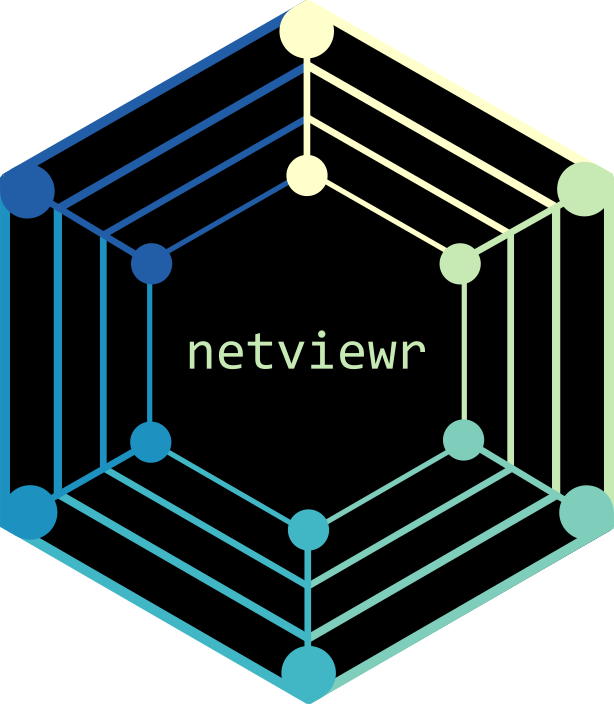
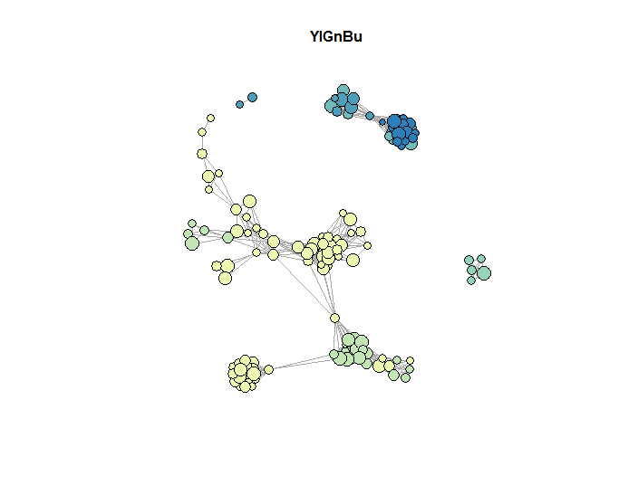
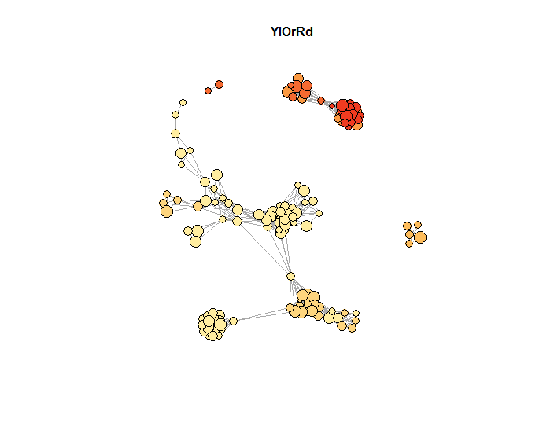
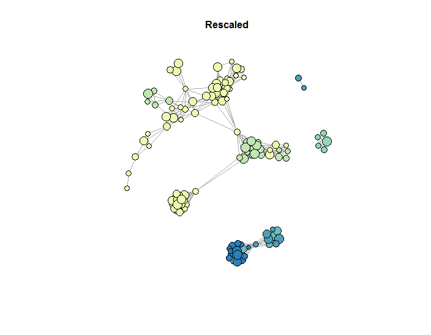
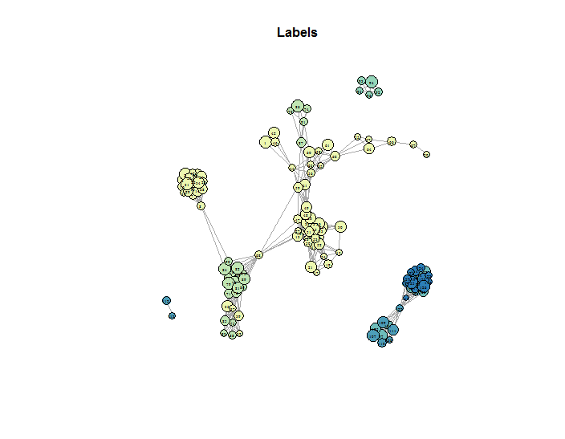
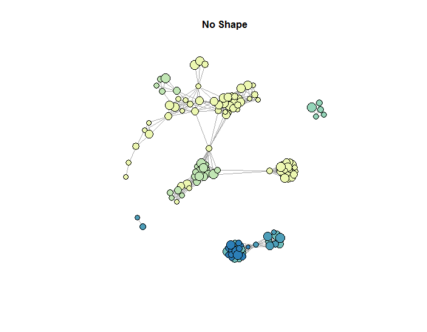
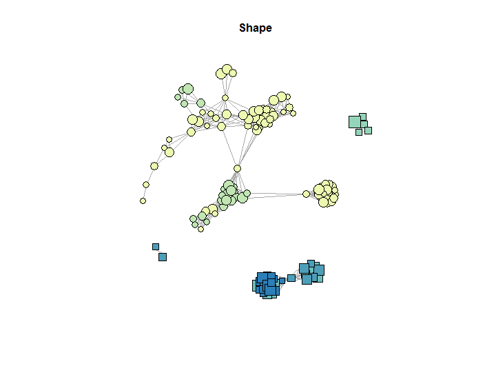
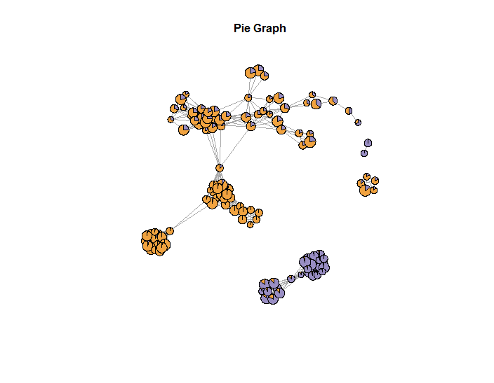
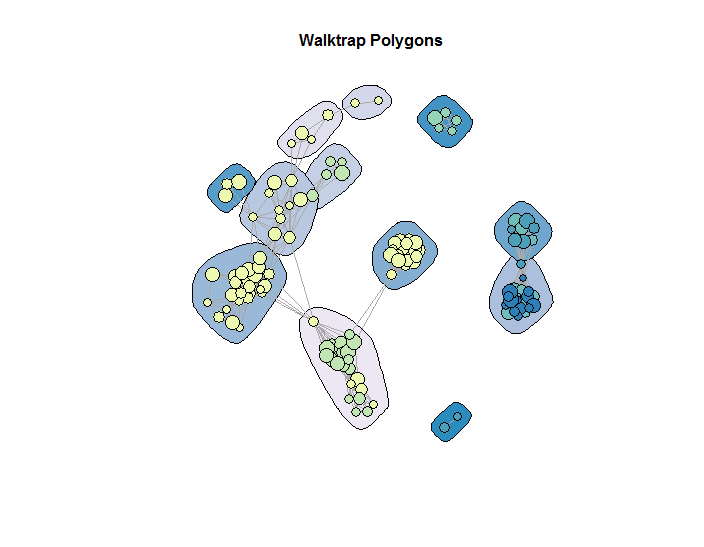
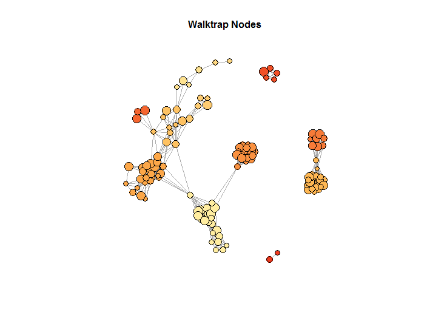

# netviewr <a href='https://github.com/esteinig'></a>


## Overview

The `netviewr` package offers a set of operators and functions that make 
working with data-driven plots of `igraph` objects more pleasant, mainly by:
  
  - decorating graph objects with user data
  - translating data into graph attributes
  - mapping to geographical projections

##

The workhorse of the package is the decorator operator `%@%`. It accepts an `igraph` object (left side) and pipes it 
into a decorator function (right side). Decorator functions transform data into graph attributes and attach them
to the correct slots in the graph object for use in the plot function. Several decorator functions in sequence can
stack their outputs onto the graph. The pipeline ends with the `magrittr` pipe operator `%>%` to feed the decorated graph
into the plot function:

```r
g <- igraph::sample_gnm(n=10, m=15) %@%                       # generate random graph with 10 nodes
     node_color(data=letters[1:10], palette='BuGn') %@%       # decorate nodes with colors paletted by letters
     node_size(data=1:10, min=5, max=8)                       # decorate nodes with values rescaled by integers

g %>% plot_netview()                                          # plot decorated graph from magrittr pipe
```

## Installation

``` r

# Install netviewr:
install.packages("netviewr")

# Development version from GitHub:
# install.packages("devtools")
devtools::install_github("esteinig/netviewr")
```
## Usage

### Decorator Pipelines

Besides decorator functions, decorator operators can accept a `data.frame` or `tibble` containing the data to stack on the graph. This
allows for passing the column name to the decorator function:

```r
node_data <- tibble(x=letters[1:10], y=1:10)        # generate 10 x 2 node data tibble

g <- igraph::sample_gnm(n=10, m=15) %@%             # generate random graph with 10 nodes
     node_data %@%                                  # decorate graph with node data tibble
     node_color(data='x', palette='BuGn') %@%       # decorate nodes with colors paletted by x
     node_size(data='y', min=5, max=8)              # decorate nodes with values rescaled by y
     
g %>% plot_netview()                                # plot decorated graph from magrittr pipe
```

The pipeline can also be executed on a list of graphs, here we add labels and pipe the list of decorated graphs
into a panel view with legends. 

```r

graphs <- lapply(1:2, function(x) igraph::sample_gnm(n=10, m=15)) %@%   # generate list of random graphs
          node_data %@%                                                 # decorate graphs with node tibble
          node_color(data='x', palette='PuOr') %@%                      # decorate graphs with node colors
          node_label(data='x', color='black', size=0.8) %@%             # decorate graphs with node labels
          node_size(data='y', min=15, max=20)                           # decorate graphs with node sizes
     
graphs %>% plot_netview(legend='x', ncol=2)                             # plot all decorated graphs
```

Graphs from lists can also be selected using the `magrittr` select operator `%$%` if the list is named, or the `tidyr` function `extract`:

```r
graphs %>% tidyr::extract(1:2) %>% plot_netview()                   # use tidyr extract pipeline
```

### Plot Netview

The `plot_netview` function translates the decorated graphs into plots using `igraph::plot.igraph`. Note that all settings provided with decorator functions can be overwritten or refined by passing standard arguments for `igraph::plot.igraph` to `netviewr::plot_netview`. Legends and titles can be set using the `legend` and `title` arguments. If either `ncol` or `nrow` are set, the function expects a list of graphs, which is then translated into a panel view containing up to four plots. Graphs can be piped into the plot function using the `magrittr` operator `%>%` - this allows users to configure graphs by setting a basic configuration, and then change attributes on subsequent graph assignments.

```r
base_graph <- igraph::sample_gnm(n=10, m=15) %@%
     node_data %@%                                      
     node_size(data='y', min=5, max=8) 

base_graph %@% node_color(data='x', palette='BuGn') %>% plot_netview()
base_graph %@% node_color(data='y', palette='PuBu') %>% plot_netview()
```

### Decorator Functions

Decorator functions modify the graph object by translating data into graph attributes and attaching it to the appropriate slots in the graph object. These are eventually recognized by the plot function so that graphs can be constructed and decorated independently of the plot arguments, which in their original implementation can be a little arcane. 

**Node Decorators**

##

```r
node_color(g, data=NULL, condition=NULL, palette='BuGn', color='gray', opacity=1, n_color=NULL)
```

Map string or factorial data to node colors from a `palette` or set a uniform `color` if no data is provided.

 

##

```r
node_size(g, data=NULL, size=4,  min=5, max=10)
```

Map numeric data to node sizes, rescale the data to a range of `min` and `max` sizes, or set a uniform `size` if no data is provided.

 

##

```r
node_label(g, data=NULL, label=NA, size=0.8, color='black', family='serif', font=1, dist=0)
```

Map string data as labels or set a uniform `label` if no data is provided. Labels can be somewhat refined with arguments in this decorator, but more sophisticated options are available in `igraph::plot.igraph`.

 

##

```r
node_shape(g, data=NULL, shape=c('circle', 'square', ...))
```

Map string or factorial data to a node shape, recycles values if more data levels available than shapes.

 

**Special Decorators**

##

```r
node_pie(g, data=NULL, palette='BuGn', n_color=NULL, border_color='black', match_func=dplyr::starts_with)
```

Map proportional data values over `m` categories (must sum to 1) to nodes that represent pie graphs, where each slice is colored according to `palette`. Data can be a `tibble`, `data.frame` or string column name, in which case the data argument uses the `match_func` to select the columns from the data the graph was decorated with. For instance, if all columns that hold the pie graph values start with `pie`, such as `pie_1`, `pie_2` and `pie_3` the data argument would be `data = 'pie'`.



##

```r
community(g, method='walktrap', polygon=NULL, palette='PuBuGn', opacity=1, border=NA, n_color=NULL, ...)
```

Detect communities in the graph and draw polygons colored by `palette` around the clusters in the network topology. Multiple community detection methods can be specified. If `polygon` is a boolean and `TRUE` the first method is used to draw polygons, otherwise the polygon accepts a string specifying which community detections results should be drawn, e.g. `polygon = 'walktrap'`. Any other named arguments that specify the behaviour of the community detection algorithm can be passed via the ellipsis argument (`...`). Community detection can be run before assigning other node attributes. The name of the community detection algorithm then map community membership to node attributes, for example:

```r
g <- igraph::sample_gnm(n=10, m=15) %@% 
     community(method='walktrap') %@%
     node_color(data='walktrap', palette='BuGn')
```

 

#### Custom Decorator Functions

Decorators are functions that require a graph object (`g`) and return an anonymous function (`func`) that first modifies and then returns the graph object. A simple example would be a decorator that assigns node colors via a `colorize` function. Without error checks and other essential behaviour and for demonstration purpose only, this could then be written as:

```r
node_color <- function(g, data=NULL, palette='BuGn', ...){
  func <- (g, ...) {
    V(g)$color <- colorize(data, palette)
    return(g)  
  }
return(func)
}
```

#### Geonet

...


