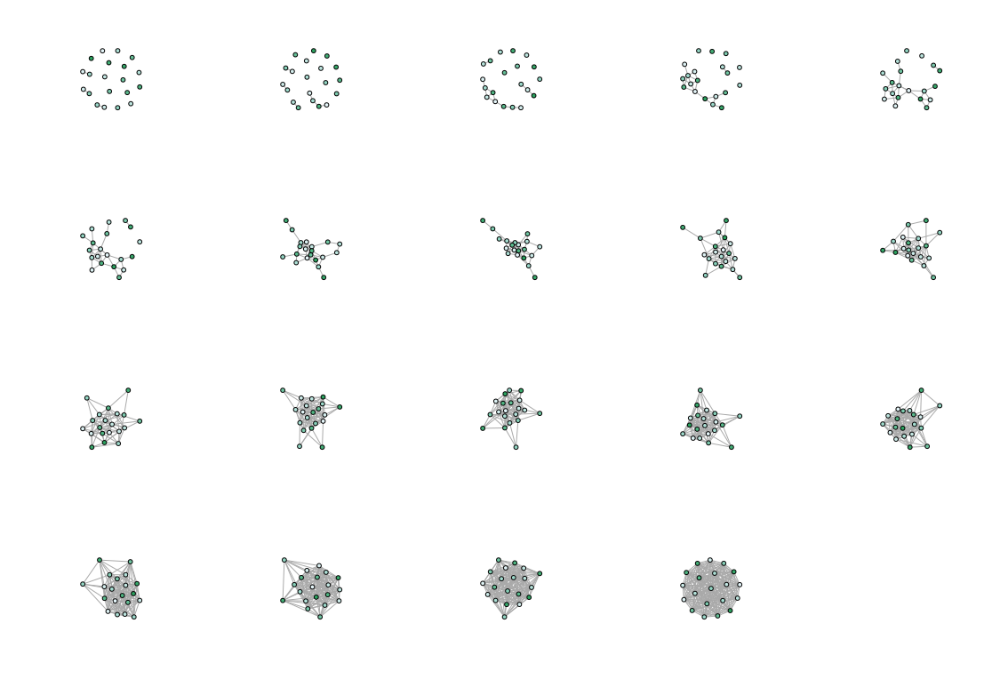
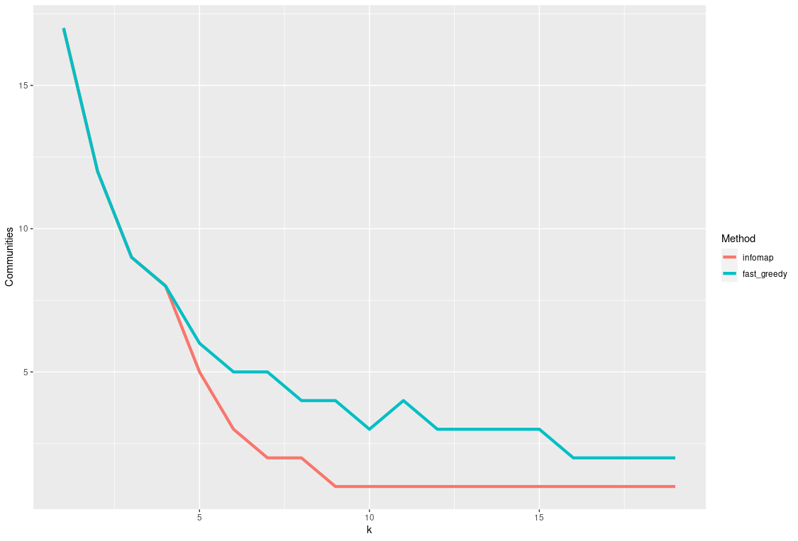

# Population genomics
`Netview` was originally developed to provide a means of visualizing complex, high-resolution population structure and associated meta-data. In the original publications by [Neuditschko et al. (2012)](https://doi.org/10.1371/journal.pone.0048375) and [Steinig et al. (2016)](https://doi.org/10.1111/1755-0998.12442) we demonstrated that these visualizations can be quite useful to unravel natural population structures (e.g. wolf populations) and pedigree structures (e.g. pearl oysters). In subsequent publications, we have also used `Netview` to visualize population structure of bacterial pathogens (e.g. [*Staphylococcus aureus*](https://doi.org/10.1128/mBio.01105-19)) and many other cool examples now exist in the literature (e.g. [Koala populations](https://doi.org/10.1007/s10592-015-0784-3) or [shark hybridisation in the Galapagos](https://doi.org/10.1007/s10592-017-0967-1)).

`Netview` is primarily designed to visualize structure from genetic similarity matrices, not determine a 'correct' population structure. One of the reasons for this is that we directly use the distance matrix in the mutual k-nearest-neighbor algorithm, where the number of mutual nearest-neighbors parameter (*k*) can be chosen to unravel structure at *any* resolution: a smaller value results in many disjointed groups of individuals ("high resolution") and a larger value causes the topologies to become more heterogenous ("low resolution"). We always run statistically more sophisticated software for population structure determination (like `Structure` or `Admixture`) in parallel with `Netview`. 

We do provide a selection method, which can be used to determine an 'optimal' value for the number of mutal nearest-neighbors based on the congruence of community (cluster) detection algorithms run over a range of parameter values (see below). Please note that this is not a biological optimisation i.e. the congruence does not tell us anything about the optimal number of populations in the data. Instead, it tells us at what resolution the network *assembles* into a coherent topology. However, in our experience, this often coincides with the optimal number of populations inferred using other population genomic approaches. 

`Netviewr` provides specialised decorator functions for these genetic applications, including pie charts for admixture proportions of each inidvidual sample (e.g. derived from `Admixture`). Community detection algorithms can be used to demarcate and sort individuals into groups determined from the structure in the network topologies.

## Population graphs

### Input distance matrix

Before using `Netview` to obtain a mutual *k*-nearest-neighbor graph, a distance matrix should be computed that is suitable for your type of data. For example, for eukaryotic SNP panels, you may want to use the `1-IBS` matrix that can be computed in `PLINK`. For others applications, e.g. in bacterial pathogen whole genome sequence data, you may want to compute a simple SNP distance matrix from reference alignments, e.g. with the excellent Rust package [`psdm`](https://github.com/mbhall88/psdm). You can also use a phylogenetic tree as the basis for your distance matrix, e.g. by computing pairwise root-to-tip distance between samples, or even using a non-genetic distance measure of similarity.

> ⚠️ Missing data may bias the mutal nearest-neighbor algorithm to find similarity between individuals with shared missing sites. Data on which the distances are based should be reasonably high resolution (e.g. not microsatellites).

### Population graph inference

`Netviewr` can be used along with a `data.frame` or `tibble` to overlay meta data on the nodes (individuals) in the graph. For example, you may want to reference admixture proportions of each individual in the poulation structure, or investigate the assignment of predefined populations (e.g. pedigrees) compared with genetic population structure.

> ⚠️ Data must have the same number of rows as there are nodes and **in the same order** as rows in the input distance matrix.

```r
library(netviewr)
```

Let's create a series of mutual k-nearest-neighbor graph from random distances between 20 samples:

```r
dist <- matrix(rnorm(400),nrow=20)
```

We can then pipe the matrix into the graph builder, noting that the highest value of `k` is `n-1`:

```r
dist %>% netview(k=1:19)
```

Let's say we have a dataframe specifying some values for each sample, which we want to plot as node colors:

```r
node_data <- data.frame(some_data=letters[1:20])
```

We can now decorate the graphs (`%@%`) with the data frame and use the `node_color` [decorator](DECFUNC.md) to map the data values to colors:

```r
g <- dist %>% netview(k=1:19) %@% node_data %@% node_color(data="some_data", palette="BuGn")
```

Plot the decorated graphs individually or as a panel:

```r
 g %>% plot_netview()                 # single plots
 g %>% plot_netview(nrow=4, ncol=5)   # panel plots
```

Graph construction from a distance matrix file (symmetrical without column or row names) using default plotting without data decoration:

```r
as.matrix(read.csv("dist.tsv", sep="\t", header=F)) %>% netview(k=20) %>% plot_netview()
```

Of course this pipeline also works without piping:

```r
dist_matrix <- as.matrix(read.csv("dist.tsv", sep="\t", header=F))
g <- netview(dist_matrix, k=20)
plot_netview(g)
```

### Graph layout and interpretation

Nodes that share many edges (mutual nearest neighbors) tend to cluster together in the default network visualization algorithm (`Fruchterman-Reingold`). 

> :warning: Graph layouts **do not hold any interpretive value**. Clusters that are not connected or connected only by few edges can be rearranged by the layout algorithm, so that two closely located but unconnected clusters of nodes do **not** indicate genetic similarity. This information is exclusively determined by the edges.

For example, note the orientation and location of disconnected clusters in these two **equivalent** graphs:

  

## Community detection

Available methods for the community detection decorator function:

```
edge_betweenness 	Community structure detection based on edge betweenness
fast_greedy 	        Community structure via greedy optimization of modularity
fluid_communities 	Community detection algorithm based on interacting fluids
infomap 	        Infomap community finding
label_prop 	        Finding communities based on propagating labels
leading_eigen 	        Community structure detecting based on the leading eigenvector of the community matrix
leiden 	                Finding community structure of a graph using the Leiden algorithm
louvain 	        Finding community structure by multi-level optimization of modularity
optimal 	        Optimal community structure
spinglass 	        Finding communities in graphs based on statistical meachanics
walktrap 	        Community strucure via short random walks
```

For more on community clustering and available algorithms see the [`igraph` reference manual](https://igraph.org/r/doc/communities.html).

## K-selection plots

We can 'optimise' the k-nearest-neighbor parameter technically (not biologically) - that is select a minimum value at which the network assembly becomes stable and less disjointed. Note that it may still be worth exploring structure and finer scales (lower values) for example to tease apart family pedigrees or explore larger scale relationships between populations (higher values).

> Empirical values from real data are around `k = 10 - 20` (fine structure) and `k = 20 - 30` as a good starting point for exploration

One way this can be done is by tracking the assembly of the network across a range of parameter values. Here the panel view from the inference example above nicely shows the assembly of the mutal k-nearest-neighbor graph with increasing nearest-neighbor parameter. We can use this assembly phase in combination with community detection algorithms to find a stable assembly of the graph.



The idea is to use congruence between multiple community detection algorithms to track the number of clusters in the network at each value of `k` over the whole range of k-nearest-neighbor parameters possible for the network. You may not need the whole range for datasets with many individuals, as usally the assembly phase completes within the empirical value range (above).

Fortunately, the graph building is usually fast. Essentially you can pipe the list of graphs into the community detection decorator and then into the `plot_kselect` function. Note we are using some random positive distance values, as some community clustering algorithms do not accept negative distances (which should not be the case for genetic distances anyway).

```r
matrix(rnorm(400, mean=1, sd=0.1), nrow=20) %>% 
  netview(k=1:19) %@%
  community(method=c('infomap', 'fast_greedy')) %>%
  plot_kselect()
```

This will produce a plot of the number of detected clusters across `k`, which indicates a stable assembly of the graph (a minimum range for the `k` parameter) between `k = 5 - 10`, i.e. the end of the 'elbow' of the plot, after the number of clusters rapidly decreases across both algorithms. Note that the precise outcome of different detection algorithms is not relevant for this approach. You can see that this value range matches the assembly phase at the end of the first row and in the second row in the panel plot above.




### Admixture plots

...
